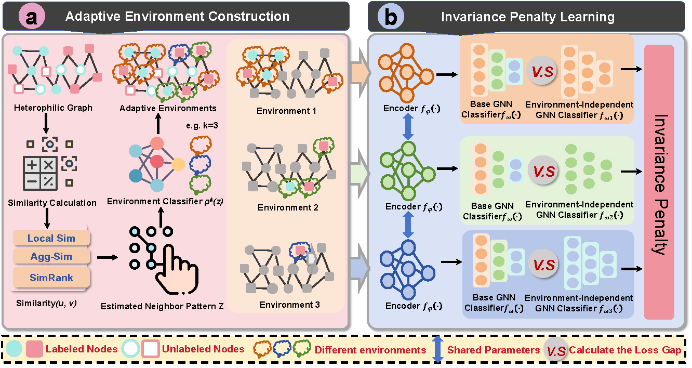

# Leveraging Invariant Principle for Heterophilic Graph Structure Distribution Shifts （ICLR2025)



## Citation
```
@article{yang2024leveraging,
  title={Leveraging Invariant Principle for Heterophilic Graph Structure Distribution Shifts},
  author={Yang, Jinluan and Chen, Zhengyu and Xiao, Teng and Zhang, Wenqiao and Lin, Yong and Kuang, Kun},
  journal={arXiv preprint arXiv:2408.09490},
  year={2024}
}

```